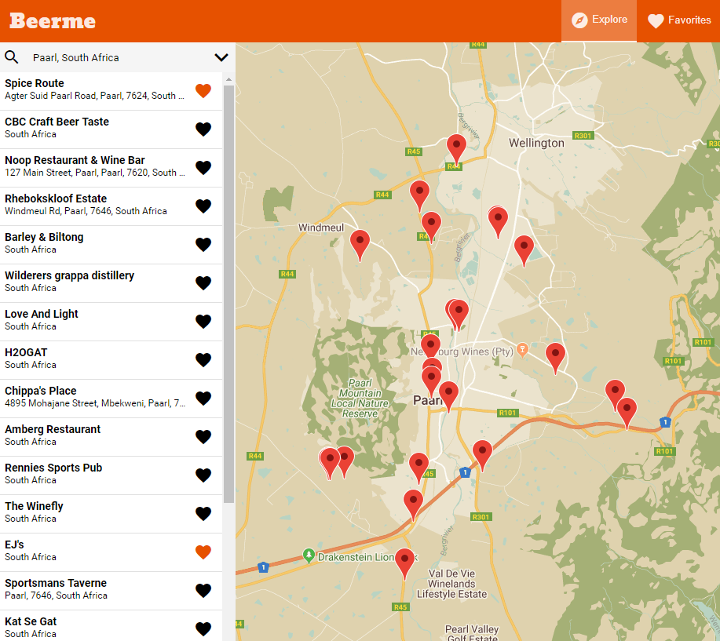
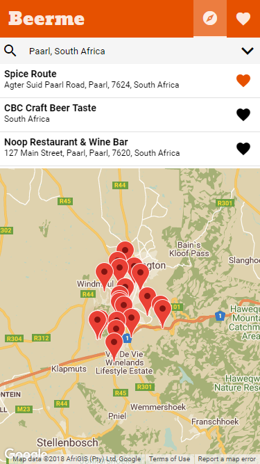
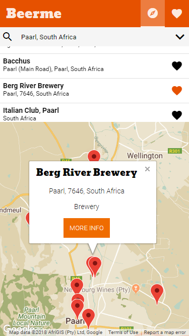
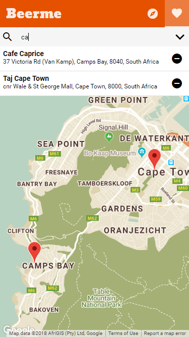

# Udacity Project - Neighborhood Map

This is my project submission for the Udacity Fullstack Developer Nanodegree, Frontend Module, Neighborhood Project.

This project showcases a single page web application using Knockout and RxJS Observables.

**Features:**
 - Search for a location by address using Google Geocoder service
 - Find nearby places/venues, and get venue details using the **Foursquare API**
 - Presents places/venues on a Google Map
 - Store/remove favorite places (stored in browser local storage)

## Installation

Install dependencies with `npm install`

## Run Application

Either open `dist/index.html` in a brower or launch the dev server using `npm run serve`.

## Development Commands

This project uses Webpack 4 to bundle and serve resources.

 - `npm run serve` - Launch webserver and watch changes
 - `npm run watch` - Build dist and watch changes
 - `npm run dev` - Bundle development build to `/dist`
 - `npm run prod` - Bundle production build to `/dist`

## Screenshots

*Explore Location - Desktop Size*

*Explore Location - Mobile*

*Show Info*

*Filter Favorites*

## Udacity Project Specifications

### Project Overview

*You will develop a single page application featuring a map of your neighborhood or a neighborhood you would like to visit. You will then add functionality to this map including highlighted locations, third-party data about those locations and various ways to browse the content.*

### Helpful Resources
*None of these are required, but they may be helpful.*

 - [Foursquare API](https://developer.foursquare.com/)
 - [MediaWikiAPI for Wikipedia](http://www.mediawiki.org/wiki/API:Main_page)
 - [Google Maps Street View Service](https://developers.google.com/maps/documentation/javascript/streetview)
 - [Google Maps](https://developers.google.com/maps/documentation/)
 - [Project 5 Overview WebCast](https://github.com/udacity/fend-office-hours/tree/master/Javascript%20Design%20Patterns/P5%20Project%20Overview)
 - [Knockout JS Tutorials](http://learn.knockoutjs.com/)
 - [Todo MVC Knockout Example](http://todomvc.com/examples/knockoutjs/)